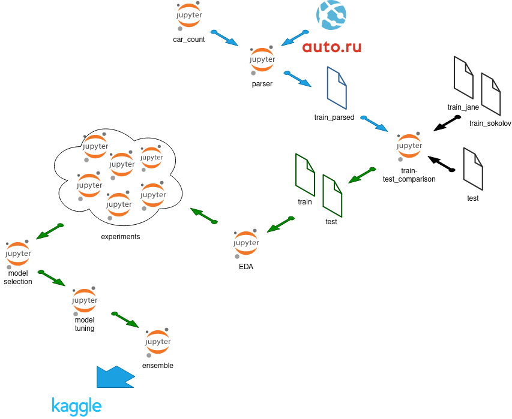

# Project 6: predicting car prices

Skillfactory, Data Science PRO course, [kaggle competition](https://www.kaggle.com/c/sf-dst-car-price-prediction)

Made by:

- Petr Polyakov - [Kaggle](https://www.kaggle.com/xelorrelin), [GitHub](https://github.com/XelorR), [GitLab](https://gitlab.com/XelorR)
- Michael Vasiliev - [Kaggle](https://www.kaggle.com/michaelvasiliev), [GitHub](https://github.com/MichaelDockers)

## Setup and requirements

There are two **requirements** files:

- [requirements.txt](requirements.txt) - used for data engeneering, EDA and preprocessing. **Use it with python 3.10**
- [requirements_ml.txt](requirements_ml.txt) - used for pycaret. **Use it with python 3.7 or 3.8**

Envirenment setup example:

```bash
git clone https://github.com/XelorR/sf_project_6
cd sf_project_6

python3 -m venv venv
source venv/bin/activate
./venv/bin/python3 -m pip install -r requirements.txt
```

## Workflow



### Notebooks

- [car_count](20220327_model_counts.ipynb)
- [parser](UsedCars_Project_Module_6_parser_20220401.ipynb)
- [train-test_comparison](2022-04-02_train-test_comparison.ipynb)
- [EDA](2022-03-31_train-test_EDA.ipynb)
- [model selection](2022-04-11_experiments_pycaret_preprocessing_and_model_selection.ipynb)
- [model tuning](2022-04-12_experiments-sklearn.ipynb)
- [ensemble](2022-04-15_ensemble.ipynb)
- more in experiments section

### Data

#### Raw

- [train_jane](data/train_df_full_part1.pkl.zip) - dataset by [Jane Voytik](https://www.kaggle.com/datasets/eugeniavoytik/final-car-price-prediction-df-parsed-sep-2021)
- [train_sokolov](data/all_auto_ru_09_09_2020.pkl.zip) - dataset by [Aleksandr Sokolov](https://www.kaggle.com/datasets/sokolovaleks/parsing-all-moscow-auto-ru-09-09-2020)
- [test](data/test.pkl.zip) - test form [Kaggle](https://www.kaggle.com/c/sf-dst-car-price-prediction)
- [sample_submission](data/sample_submission.csv) - submission example from [Kaggle](https://www.kaggle.com/c/sf-dst-car-price-prediction)

#### Parsed

- [SPB](20220401_spb_parsed_data.pkl.zip
- ...to combine and specify others

#### Preprocessed

- [train](data/2022-04-06_train_preprocessed.pkl.zip)
- [test](data/2022-04-06_test_preprocessed.pkl.zip)
- [train_premodel](data/2022-04-08_train_pre-model.parquet)
- [test_premodel](data/2022-04-08_test_pre-model.parquet)


### Experiments

| Date       | Model                    | Made using file                                             | MAPE   | Comments                             | Kaggle       |
|------------|--------------------------|-------------------------------------------------------------|--------|--------------------------------------|--------------|
| 2022-04-08 | CatBoostRegrassor        | [EDA](2022-03-31_train-test_EDA.ipynb)                      | 13.76  |                                      |              |
| 2022-04-08 | XGBRegressor             | [EDA](2022-03-31_train-test_EDA.ipynb)                      | 14.1   |                                      |              |
| 2022-04-08 | RandomForestRegressor    | [EDA](2022-03-31_train-test_EDA.ipynb)                      | 14.25  |                                      |              |
| 2022-04-08 | AdaBoostRegressor        | [EDA](2022-03-31_train-test_EDA.ipynb)                      | 405.19 | dummy encoding                       |              |
| 2022-04-08 | AdaBoostRegressor        | [EDA](2022-03-31_train-test_EDA.ipynb)                      | 562.54 | label encoding                       |              |
| 2022-04-12 | LinearRegression         | [experiments sklearn](2022-04-12_experiments-sklearn.ipynb) | 79.46  | default params                       | 80.53        |
| 2022-04-12 | KNeighborsRegressor      | [experiments sklearn](2022-04-12_experiments-sklearn.ipynb) | 16.95  | default params                       | 17.75        |
| 2022-04-12 | LGBMRegressor            | [experiments sklearn](2022-04-12_experiments-sklearn.ipynb) | 19.1   | default params                       | 19.8         |
| 2022-04-12 | LGBMRegressor            | [experiments sklearn](2022-04-12_experiments-sklearn.ipynb) | 15.62  | optuned                              | 17.44        |
| 2022-04-12 | CatBoostRegressor        | [experiments sklearn](2022-04-12_experiments-sklearn.ipynb) | 15.85  | default params                       | 16.5         |
| 2022-04-12 | RandomForestRegressor    | [experiments sklearn](2022-04-12_experiments-sklearn.ipynb) | 13.8   | default params                       | 12.6         |
| 2022-04-12 | StackingRegressor        | [experiments sklearn](2022-04-12_experiments-sklearn.ipynb) | 13.55  | default params                       | 13.25        |
| 2022-04-15 | LGBMRegressor            | [ensemble](2022-04-15_ensemble.ipynb)                       | 15.62  | lightgbm_v1_optuned                  | 17.44        |
| 2022-04-15 | LGBMRegressor            | [ensemble](2022-04-15_ensemble.ipynb)                       | 12.66  | lightgbm_v2_optuned                  | 13.37        |
| 2022-04-15 | LGBMRegressor            | [ensemble](2022-04-15_ensemble.ipynb)                       | 12.68  | lightgbm_v3_optuned                  | 13.39        |
| 2022-04-15 | XGBRegressor             | [ensemble](2022-04-15_ensemble.ipynb)                       | 11.97  | xgb_v1_manual                        | 11.69        |
| 2022-04-15 | XGBRegressor             | [experiments sklearn](2022-04-12_experiments-sklearn.ipynb) | 11.97  | xgb_v2_trial_132                     | 11.97        |
| 2022-04-15 | XGBRegressor             | [experiments sklearn](2022-04-12_experiments-sklearn.ipynb) | 11.98  | xgb_v2_trial_139                     | 11.74        |
| 2022-04-15 | XGBRegressor             | [experiments sklearn](2022-04-12_experiments-sklearn.ipynb) | 11.99  | xgb_v2_trial_134                     | 11.96        |
| 2022-04-15 | XGBRegressor             | [experiments sklearn](2022-04-12_experiments-sklearn.ipynb) | 11.97  | xgb_v2_trial_138                     | 11.97        |
| 2022-04-15 | XGBRegressor             | [experiments sklearn](2022-04-12_experiments-sklearn.ipynb) | 11.98  | xgb_v2_trial_135                     | 11.97        |
| 2022-04-15 | ExtraTreesRegressor      | [ensemble](2022-04-15_ensemble.ipynb)                       | 13.76  | etr_v1_manual                        | 14.41        |
| 2022-04-15 | ExtraTreesRegressor      | [ensemble](2022-04-15_ensemble.ipynb)                       | 12.43  | etr_v2_optuned                       | 11.82        |
| 2022-04-15 | ExtraTreesRegressor      | [ensemble](2022-04-15_ensemble.ipynb)                       | 12.96  | etr_v3_default                       | 11.08        |
| 2022-04-15 | RandomForestRegressor    | [ensemble](2022-04-15_ensemble.ipynb)                       | 13.15  | rf_v1_manual                         | 12.43        |
| 2022-04-15 | RandomForestRegressor    | [ensemble](2022-04-15_ensemble.ipynb)                       | 12.68  | rf_v2_optuned                        | 12.19        |
| 2022-04-15 | RandomForestRegressor    | [ensemble](2022-04-15_ensemble.ipynb)                       | 12.75  | rf_v3_default                        | 11.98        |
| 2022-04-15 | CatBoostRegressor meta   | [ensemble](2022-04-15_ensemble.ipynb)                       |        | blending_v1                          | 11.89        |
| 2022-04-15 | CatBoostRegressor meta   | [ensemble](2022-04-15_ensemble.ipynb)                       |        | blending_v2                          | 11.5         |
| 2022-04-15 | CatBoostRegressor meta   | [ensemble](2022-04-15_ensemble.ipynb)                       |        | blending_v3                          | 11.59        |
| 2022-04-15 | ExtraTreesRegressor meta | [ensemble](2022-04-15_ensemble.ipynb)                       |        | blending_v4                          | 12.27        |
| 2022-04-17 | ExtraTreesRegressor      | [etr notebook](model_ExtraTrees_optuna.ipynb)               |        | 300 estimators                       | 11.02602     |
| 2022-04-17 | ExtraTreesRegressor      | [etr notebook](model_ExtraTrees_optuna.ipynb)               |        | 500 estimators                       | 11.00694     |
| 2022-04-17 | ExtraTreesRegressor      | [etr notebook](model_ExtraTrees_optuna.ipynb)               |        | 800 estimators                       | 11.00655     |
| 2022-04-17 | ExtraTreesRegressor      | [etr notebook](model_ExtraTrees_optuna.ipynb)               |        | 1200 estimators - **the best model** | **11.00263** |


## Conclusions / what was done

- data scrabing, parsing and data engeneering
  - auto.ru have implemented new parsing protection - selenium used but worked much slower than requests - could not gather enought records
  - in 2022 we faced with more outliers and unpredictable price changes due to geopolitical situation
  - we decided to use 2 best voted datasets downloaded from Kaggle
  - we have combined 2 pre-parsed datasets: from 2020 and 2021, price in 2021 was corrected to be similar to 2020 and comparable to test data
  - features was reformatted to make both datasets similar to each other
  - all features which have one or less categories dropped
  - features unique to only one dataset dropped
- EDA
  - due to lack of time availble we decided to drop **description** but it could be used to better feature creation
  - owning_time col dropped due to large amount of NAs in train
  - pts NAs filled with mode
  - numerics are not normally distributed - was scaled using yeo-johnson instead of log
  - feature importance calculated using model's built in functionality
- modelling
  - most of features are categorical - decided to use dummy encoding in most cases except model_name due to large amount of categories
  - model_name encoded with LabelEncoding
  - normalized numeric features using RobustScaler
  - took a log of Label col ("price") to convert outliers
  - model selection done using **pycaret** - etr, catboost, lightgbm, xgboost, rf and knn tooked for futher experiments and tuning
  - most valuable kaggle-improvers are RandomForestRegressor and ExtraTreesRegressor
  - by some undescoverable reason blending and stacking of best model wasn't omprove the score
  - best score achieved just manually tweaking ExtraTreesRegressor

## insights / what was learned

- ADA is the worse model despite being boostin - all others worked much better
- Trees are good for categorical datasets
- Model tuning is better to use from:
  - laptop for CPU-poered models
  - Google Colab for GPU-powered and memory intensive models
- virtual machines are good to paralellize parsing if selenium used
- more machines and more resources needed to do enough experiments and finetune model parameters
- git repos are very valuable for team work: saving notebooks, pre-tuned models and pre-pocessed data was very useful
- you can serialize and compress large datasets to put it into github
- you can save dataset on GitHub and use direct link to it from either local machine or Colab/Kaggle notebooks
- we got deeper understanding of modern boosting algorithms such as XGBoost, CatBoost and LightGBM:
  - XGBoost performs more like sklearn GBM and showed better results with this exact competition
  - LightGBM is the fastest learning and good for first sight and overview
  - CatBoost is the best out of the box but hard to tune
- learned how to use Optuna for more efficient hyperparameter tuning
- forests and extra trees are the most memory consuming things

## what can be improved

- better stacking using ExtraTreesRegressor with more estimators and other models with deeper tuning (we had no enough memory to create stacking we imagined)
- tune models using two steps:
  - most impactful parameters only
  - fixing parameters from previous step and working on overfitting
- buy better equipment
- start with first working model earlier

## TO DO

- [x] org - Petr create repo, organize access
- [x] new - Petr - search for external datasets
- [x] new - Michael - create basic parser (first pages only)
- [x] new - Michael - expand parser to all pages for each model
- [x] new - Petr - compare Jane's train with test and insure feature consistency
- [x] org - both - align how to split and run parser on multiple machines 
- [x] fix - Michael - **get_urls_for_model_in_region** falling into infinite loop in case of too many pages
- [x] new - Petr - analyze [number of cars](20220327_model_counts.ipynb) to parse for each model and propose model split
- [x] new - both - run parser separately on several machines
    - [x] spb except bmw, mercedes, wolkswagen, mitsubishi
    - [x] spb mitsubishi
    - [x] spb bmw, mercedes, wolkswagen
    - [x] msk exclude mers and vw
    - [x] the rest
    - [x] spb catalog
- [x] new - Petr - update and push prefinal parser 
- [x] org - Petr - form a Kaggle Team
- [x] new - Petr - add "baseline" train dataset and ensure having same set of cols for all 3
- [x] new - both - implement feature-related comments from [2022-03-19_train-test_comparison.ipynb](2022-03-19_train-test_comparison.ipynb)
- [x] new - Michael - preprocess BodyType
- [x] new - multiplyer for price according to USD course (or some other idea)
- [x] new - start EDA
- [x] prepare first models and calculate feature importances
- [ ] new - combine parsed datasets
- [ ] new - make parsed compatible with test
- [ ] new - append parsed to test
- [x] new - both - do experiments. A lot
